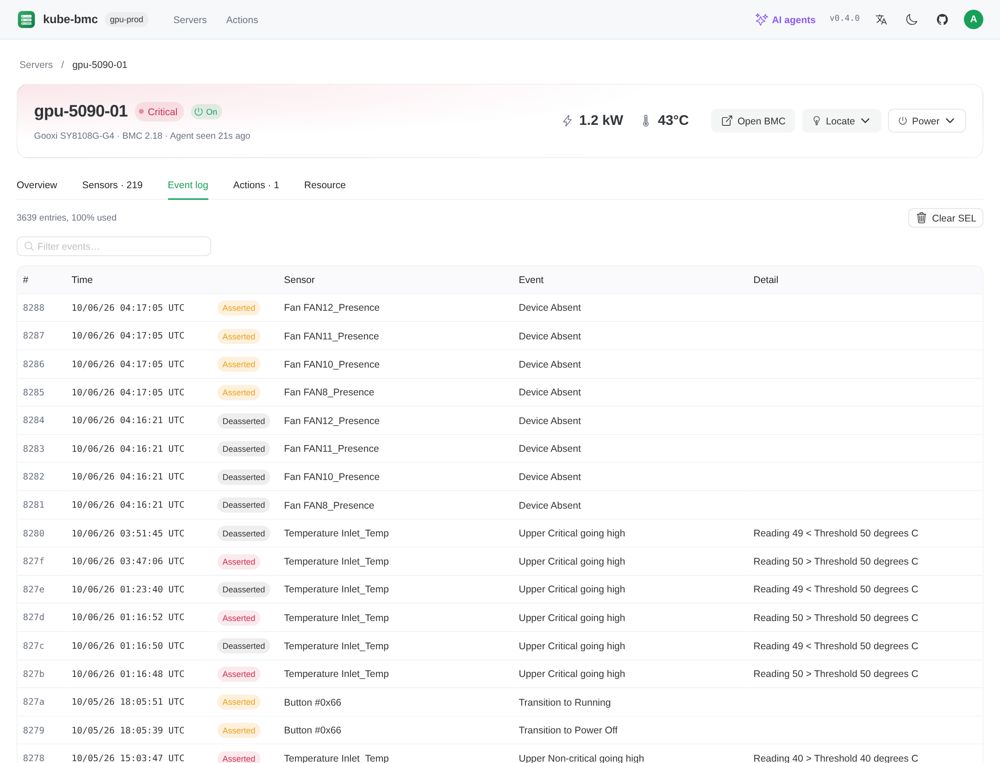
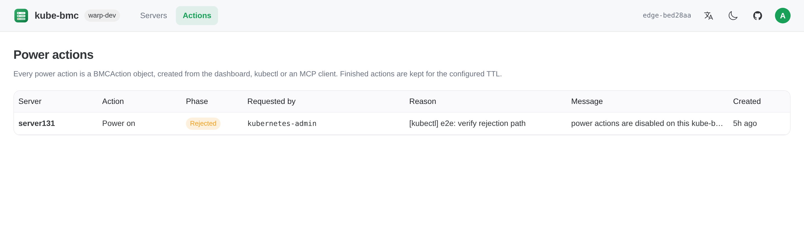
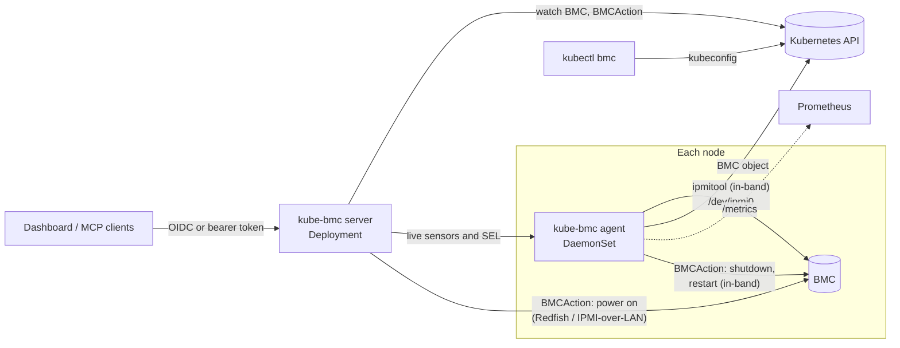

<p align="center">
  
</p>

<h1 align="center">kube-bmc</h1>

<p align="center">
  Baseboard management controllers as Kubernetes resources: in-band discovery, hardware health,<br>
  power control, a web dashboard, a kubectl plugin, a Grafana dashboard,<br>
  and an MCP endpoint so that <b>AI agents can inspect and operate your servers</b>.
</p>

<p align="center">
  <a href="https://github.com/aireet/kube-bmc/actions/workflows/ci.yml"></a>
  <a href="https://goreportcard.com/report/github.com/aireet/kube-bmc"></a>
  <a href="https://scorecard.dev/viewer/?uri=github.com/aireet/kube-bmc"></a>
  <a href="LICENSE"></a>
</p>

<p align="center">
  <a href="README.zh-CN.md">简体中文</a> ·
  <a href="#installation">Installation</a> ·
  <a href="#operate-servers-with-ai-agents">AI agents</a> ·
  <a href="#architecture">Architecture</a> ·
  <a href="docs/authentication.md">Authentication</a> ·
  <a href="docs/mcp.md">MCP</a> ·
  <a href="docs/kubectl.md">kubectl plugin</a>
</p>


<details>
<summary>More screenshots</summary>

| Server details | Sensors |
|---|---|
|  |  |
| **System event log** (decoded failed BMC logins) | **Power actions** |
|  |  |

Screenshots show real servers; addresses and serial numbers are replaced.
</details>

## Overview

kube-bmc runs an agent on every node that reads the local BMC through the in-band IPMI
interface (`/dev/ipmi0`). No BMC addresses or credentials are needed for monitoring. Each node
gets a cluster-scoped `BMC` object that is owned by its `Node`:

```console
$ kubectl get bmc
NAME        NODE        BMC-IP          VENDOR   MODEL        POWER   WATTS   INLET   HEALTH     AGE
host002     host002     10.30.4.27      LCWT     R8285        On      951     26      Warning    2d
server131   server131   10.20.0.31      Gooxi    SY8108G-G4   On      1240    43      Critical   2d

$ kubectl get bmc server131 -o jsonpath='{range .status.problems[*]}{.severity}{"\t"}{.source}{"\t"}{.message}{"\n"}{end}'
Critical   FAN7      0 RPM below lower non-recoverable
Critical   chassis   Cooling/Fan Fault reported by the BMC
Warning    sel       System Event Log is 100% full; new hardware events may be dropped
```

Features:

- **Inventory and health** from any IPMI 2.0 BMC: FRU data, firmware, management network,
  sensors with thresholds, chassis faults, DCMI power and the System Event Log. Health is
  summarized as `OK`, `Warning` or `Critical` with a list of problems.
- **Actions**: shutdown, restart, power cycle, the identify light and clearing the System Event
  Log are executed by the agent on the node through its local BMC interface, without BMC
  credentials; power on uses Redfish or IPMI-over-LAN. Every request is a `BMCAction` object,
  which serves as the audit record. Disabled by default.
- **AI agents**: an MCP endpoint lets Claude Code and other agents inspect hardware and operate
  BMCs, with every action audited. See [Operate servers with AI agents](#operate-servers-with-ai-agents).
- **Hardware inventory**: CPU and memory configuration, GPUs and PCIe slot occupancy, read by the
  agent from SMBIOS and the PCI bus.
- **Three human interfaces**: the web dashboard, the `kubectl bmc` plugin and a Grafana dashboard.
- **Authentication** with OpenID Connect or built-in username and password for the dashboard, and
  OIDC or ServiceAccount bearer tokens for API and MCP clients.
- **Prometheus metrics** for every sensor, power draw, health and SEL usage.

## Operate servers with AI agents

kube-bmc includes a [Model Context Protocol](https://modelcontextprotocol.io) server. Connect Claude
Code, or any MCP client, and an agent can triage hardware across the fleet and, when you allow
it, act on it:

```bash
claude mcp add --transport http kube-bmc https://kube-bmc.example.com/mcp \
  --header "Authorization: Bearer $(kubectl -n kube-bmc-system create token mcp-agent)"
```

```text
> Which servers have hardware problems, and what should the data-center team do?

  ⏺ kube-bmc · fleet_summary
  ⏺ kube-bmc · get_sensors  name=gpu-07 problemsOnly=true
  ⏺ kube-bmc · get_events   name=gpu-07 limit=20

  gpu-07 (Gooxi SY8108G-G4) is critical: FAN7, FAN8, FAN10, FAN11 and FAN12 read 0 RPM and
  the chassis reports a cooling fault. Inlet temperature is 47 °C (critical above 50 °C).
  Replace the failed fan modules soon; the GPUs are still within limits.
  infer-02 is a warning: its event log is full and contains 25 failed BMC logins.

> Turn on the identify light of gpu-07 so the technician can find it.

  ⏺ kube-bmc · locate_server  name=gpu-07 on=true
  Done. The light stays on until it is turned off.
```

| Tools | |
|---|---|
| Inspect | `fleet_summary`, `list_servers`, `get_server`, `get_sensors`, `get_events`, `list_actions`, `get_action` |
| Act | `locate_server`, `clear_sel`, `power_action` (shutdown, restart, power cycle, power on) |

Agents are first-class but accountable: every action is a `BMCAction` recorded with the agent's
identity and a mandatory reason, destructive tools are annotated so clients ask before calling
them, and actions can be disabled entirely. The dashboard's **AI agents** dialog shows the
endpoint and a ready-to-copy client configuration. See [docs/mcp.md](docs/mcp.md).

## Installation

Requirements:

- Kubernetes 1.28 or later.
- Nodes with a BMC and the IPMI kernel modules loaded (`ipmi_si`, `ipmi_devintf`), so that
  `/dev/ipmi0` exists. Nodes without a BMC can be excluded with `agent.nodeSelector`.

```bash
helm install kube-bmc oci://ghcr.io/aireet/charts/kube-bmc \
  --namespace kube-bmc-system --create-namespace

kubectl get bmc
kubectl -n kube-bmc-system port-forward svc/kube-bmc 8080:80   # dashboard on http://localhost:8080
```

Plain manifests are attached to each release:
`kubectl apply -f https://github.com/aireet/kube-bmc/releases/latest/download/install.yaml`.

The chart installs without authentication. Before exposing the dashboard beyond a port-forward,
configure [authentication](docs/authentication.md).

## Architecture



**Agent.** Runs privileged on every node and polls the local BMC with read-only `ipmitool`
commands on three schedules. When actions are enabled, it also executes shutdown, restart, power
cycle, identify and ClearSEL requests for its own node.

| Data | Default interval | Notes |
|---|---|---|
| Sensors, chassis status, DCMI power, SEL info | 30s | Uses a local SDR cache; one round takes about one second |
| FRU, LAN configuration, firmware, thresholds | 10m | `ipmitool sensor` takes about ten seconds over KCS |
| SEL entries | When `sel info` reports a change, at most every 5m | Reading the full SEL can take more than 30 seconds |

The agent keeps the load on the API server and etcd low:

- Liveness is reported by renewing a small `coordination.k8s.io` Lease per node, as kubelet does
  for nodes, instead of rewriting the `BMC` status.
- The `BMC` status is written only when health, problems, conditions or inventory change, when a
  reading leaves its deadband (power ±20% or 100 W, inlet temperature ±3 °C, SEL usage ±5 points),
  or every 10 minutes. Sensor counts are refreshed with the readings. The agent patches against
  the last written object without reading it first.
- New problems are reported immediately, but a problem is removed only after it has been clear
  for 5 minutes, so sensors oscillating around a threshold do not cause repeated writes.
- Complete sensor lists and SEL entries are served by the agent on request and never stored in etcd.

In steady state each node causes about one status write per 10 minutes plus one Lease renewal per
minute. `kube_bmc_status_writes_total{reason}` reports the write rate.

**Server.** Serves the dashboard, the JSON API and the MCP endpoint, authenticates users, and
runs the controller that executes `BMCAction` objects. It is stateless and reads through an
informer cache.

**kubectl plugin.** Reads `BMC` and `BMCAction` objects directly and fetches live data from the
agents through the API server's pod proxy, using the caller's kubeconfig.

## Actions

Power actions, the identify light and clearing the System Event Log are requested as
`BMCAction` objects:

```yaml
apiVersion: bmc.kube-bmc.io/v1alpha1
kind: BMCAction
metadata:
  generateName: gpu-01-forcerestart-
spec:
  bmcName: gpu-01
  action: ForceRestart
  requestedBy: oidc:alice@example.com
  reason: kernel hang, node unreachable
status:
  phase: Succeeded            # Pending, Running, Succeeded, Failed or Rejected
  message: ForceRestart sent to the local BMC through /dev/ipmi0
  powerStateBefore: "On"
```

Who executes an action depends on whether it can be done from the node itself:

| Action | Executed by | Requirements |
|---|---|---|
| `GracefulShutdown`, `ForceOff`, `ForceRestart`, `PowerCycle` | The agent on the target node, through `/dev/ipmi0` | None; no BMC credentials or BMC network access |
| `IdentifyOn`, `IdentifyOff` | The agent on the target node | None. The light stays on until `IdentifyOff`; BMCs without indefinite identify keep it on for 255 seconds. |
| `ClearSEL` | The agent on the target node | None. The complete log is first saved to a compressed ConfigMap (`status.selArchive`), and cleared only if that succeeded. The newest `server.actions.selArchivesPerServer` archives (default 3) are kept per server. |
| `On`, `GracefulRestart` | The server, out-of-band over Redfish or IPMI-over-LAN | BMC credentials and network access from the server to the BMC |

If the agent does not claim a power action within 30 seconds, because the node is down, the
server executes it out-of-band when credentials are configured, and rejects it otherwise. Every
action is executed at most once and recorded as an Event on the `Node`. `spec.requestedBy` is set
to the authenticated user by the server (dashboard and MCP) and by kubectl-bmc.

Actions are disabled by default. To enable them:

```bash
helm upgrade kube-bmc oci://ghcr.io/aireet/charts/kube-bmc -n kube-bmc-system --reuse-values \
  --set server.actions.enabled=true
```

SEL archives can be listed and read with the kubectl plugin:

```bash
kubectl bmc sel-archives host002
kubectl bmc sel-archives host002 --show sel-host002-20261006-090000
```

For power on, also provide BMC credentials, and make sure the server can reach the BMC network:

```bash
kubectl -n kube-bmc-system create secret generic bmc-credentials \
  --from-literal=username=kube-bmc --from-literal=password='...'
helm upgrade kube-bmc oci://ghcr.io/aireet/charts/kube-bmc -n kube-bmc-system --reuse-values \
  --set server.credentials.existingSecret=bmc-credentials
```

The BMC address is discovered in-band. To override it, or to use per-server credentials or IPMI
instead of Redfish, edit the `BMC` spec (see [examples/bmc-override.yaml](examples/bmc-override.yaml)).
Finished actions are deleted after `server.actions.ttl` (seven days by default). `BMCAction`
objects are about 1 KB and only created on request; SEL archives are gzip-compressed, typically a
few tens of KB.

## Authentication

kube-bmc is intended for the team that operates the cluster: it authenticates callers and records
who requested each action, and every authenticated user has full access.

| `auth.mode` | Sign-in |
|---|---|
| `none` | No authentication (default; for `kubectl port-forward` access) |
| `password` | Usernames and bcrypt password hashes in a Secret |
| `oidc` | Any OpenID Connect provider: Keycloak, Dex, Microsoft Entra ID, Okta, Google |

```yaml
# Password mode
auth:
  mode: password
  existingSecret: kube-bmc-auth   # keys: session-secret, htpasswd
```

```yaml
# OIDC mode
server:
  externalURL: https://kube-bmc.example.com
auth:
  mode: oidc
  existingSecret: kube-bmc-auth   # keys: session-secret, client-secret
  oidc:
    issuerURL: https://login.example.com
    clientID: kube-bmc
```

[docs/authentication.md](docs/authentication.md) describes both modes step by step, with guides
for common identity providers and troubleshooting.

## kubectl plugin

```console
$ kubectl bmc list
$ kubectl bmc describe server131
$ kubectl bmc sensors server131 --problems
$ kubectl bmc events server131 --grep fan
$ kubectl bmc power server131 ForceRestart --reason "kernel hang" --wait
$ kubectl bmc locate server131            # identify light on; --off turns it off
$ kubectl bmc clear-sel server131 --reason "log full"
$ kubectl bmc actions
```

Download `kubectl-bmc` from the [releases](https://github.com/aireet/kube-bmc/releases) and place
it on your `PATH`. See [docs/kubectl.md](docs/kubectl.md).

## Metrics

Agents expose Prometheus metrics on port 9580. Every metric carries a `node` label. Set
`metrics.podMonitor.enabled=true` to create a PodMonitor.

| Metric | Description |
|---|---|
| `kube_bmc_up` | 1 if the last collection round reached the BMC |
| `kube_bmc_health` | 0 unknown, 1 ok, 2 warning, 3 critical |
| `kube_bmc_power_on`, `kube_bmc_power_watts` | Chassis power state and DCMI power draw |
| `kube_bmc_sensor_value{sensor,type,unit}` | Sensor readings |
| `kube_bmc_sensor_state{sensor,type}` | 0 ok, 1 warning, 2 critical, -1 no reading |
| `kube_bmc_chassis_fault{fault}` | Active chassis faults |
| `kube_bmc_sel_used_ratio`, `kube_bmc_sel_entries` | System Event Log usage |
| `kube_bmc_inlet_temperature_celsius` | Air inlet temperature |
| `kube_bmc_info{manufacturer,product,serial,firmware,bmc_ip,bmc_mac}` | BMC inventory |
| `kube_bmc_hardware_info{cpu_model,cpu_sockets,cpu_cores,memory_gib}` | Host hardware |
| `kube_bmc_gpus{model}`, `kube_bmc_pcie_slots{state}` | GPUs by model, PCIe slots used and free |
| `kube_bmc_collect_duration_seconds{phase}`, `kube_bmc_collect_errors_total{phase}` | Collector performance |

Example alerting rules: [examples/prometheus-rules.yaml](examples/prometheus-rules.yaml). A Grafana
dashboard is included; see [docs/grafana.md](docs/grafana.md).

## Security

- The agent runs privileged because opening `/dev/ipmi0` requires it. For monitoring it only
  issues read-only commands (`mc info`, `mc guid`, `lan print`, `fru print`, `chassis status`,
  `sdr`, `sensor`, `sel info`, `sel elist`, `sel get`, `dcmi power reading`, and reading LAN
  parameters with `raw 0x0c 0x02`). It runs `chassis power`, `chassis identify` and `sel clear`
  only for BMCActions of its own node, and only when actions are enabled.
- The server runs as non-root with a read-only root filesystem and no capabilities. It reads
  Secrets only in its own namespace.
- Without authentication (`auth.mode=none`) everyone who can reach the server has full access,
  including power actions when they are enabled. Use `password` or `oidc` for any exposed
  deployment.
- IPMI-over-LAN has known weaknesses. Keep BMC networks isolated and prefer Redfish.

Report vulnerabilities as described in [SECURITY.md](SECURITY.md).

## Configuration

All chart values are documented in [charts/kube-bmc/values.yaml](charts/kube-bmc/values.yaml).

| Value | Default | Description |
|---|---|---|
| `agent.interval` | `30s` | Sensor polling interval |
| `agent.nodeSelector` | `{}` | Nodes that run the agent |
| `server.externalURL` | `""` | Public URL of the dashboard; required for OIDC |
| `server.actions.enabled` | `false` | Accept actions (power, identify light, clearing the SEL) |
| `server.credentials.existingSecret` | `""` | Default BMC credentials (`username`, `password`) |
| `server.service.type` | `ClusterIP` | Service type of the dashboard |
| `auth.mode` | `none` | `none`, `password` or `oidc` |
| `auth.existingSecret` | `""` | Secret with `session-secret`, `htpasswd` (password) or `client-secret` (oidc) |
| `auth.oidc.issuerURL` | `""` | OIDC issuer |
| `metrics.podMonitor.enabled` | `false` | Create a PodMonitor for the agents |
| `grafana.dashboard.enabled` | `false` | Create the Grafana dashboard ConfigMap for the dashboard sidecar |

## Development

```bash
make ui         # build the dashboard into web/dist
make build      # build bin/kube-bmc and bin/kubectl-bmc
make test       # unit tests
make lint       # golangci-lint and vue-tsc
make generate   # deepcopy functions and CRDs after changing api/
make dev        # dashboard with hot reload against a port-forwarded server on :8080
```

| Path | Contents |
|---|---|
| `api/v1alpha1` | `BMC` and `BMCAction` types |
| `cmd/kube-bmc` | Agent and server binary |
| `cmd/kubectl-bmc` | kubectl plugin |
| `internal/ipmi` | ipmitool client and parsers, tested against recorded output of real BMCs |
| `internal/collector` | Polling, health evaluation and metrics |
| `internal/agent` | BMC object lifecycle and agent HTTP API |
| `internal/controller` | `BMCAction` execution |
| `internal/oob` | Redfish and IPMI-over-LAN power control |
| `internal/auth` | Password and OIDC sign-in, bearer token authentication |
| `internal/server` | Dashboard API |
| `internal/mcpserver` | MCP tools and prompts |
| `internal/kubectl` | kubectl plugin commands |
| `ui` | Vue 3 and Naive UI dashboard, embedded into the server binary |
| `charts/kube-bmc` | Helm chart |

See [CONTRIBUTING.md](CONTRIBUTING.md).

## Community

- [Governance](GOVERNANCE.md) and [maintainers](MAINTAINERS.md)
- [Design proposals](docs/proposals)
- [Code of Conduct](CODE_OF_CONDUCT.md) (CNCF Code of Conduct)
- [Security policy](SECURITY.md), including how to verify signed releases
- [Adopters](ADOPTERS.md)

## License

[Apache 2.0](LICENSE)
