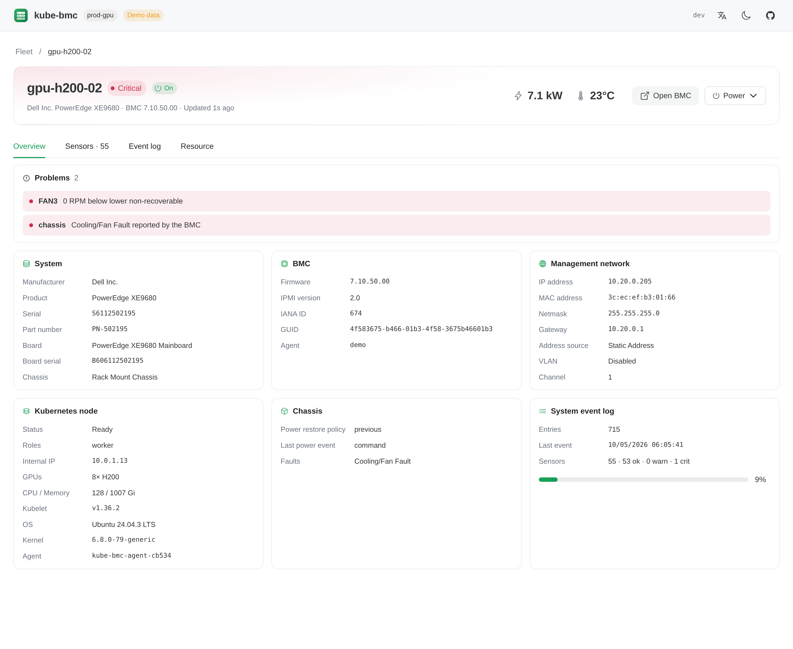
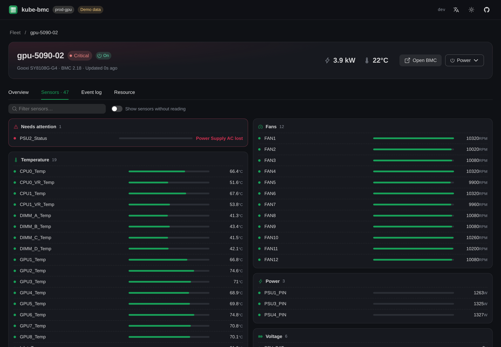
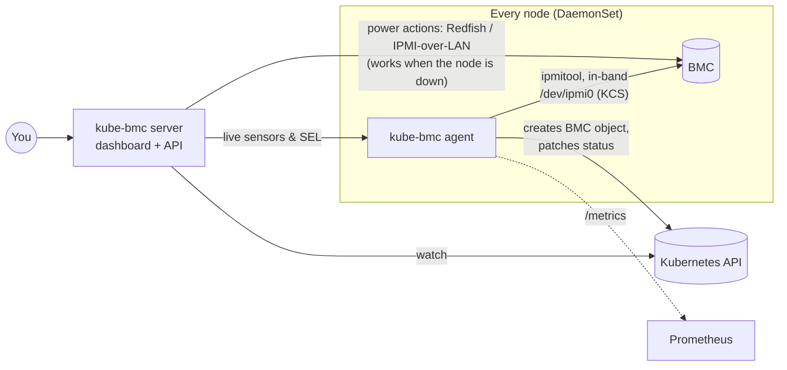

<p align="center">
  
</p>

<h1 align="center">kube-bmc</h1>

<p align="center">
  <b>Your servers' BMCs, as Kubernetes resources.</b><br>
  Zero-config hardware discovery, health and power control for bare-metal clusters — no BMC passwords, no spreadsheets.
</p>

<p align="center">
  <a href="https://github.com/aireet/kube-bmc/actions/workflows/ci.yml"></a>
  <a href="https://goreportcard.com/report/github.com/aireet/kube-bmc"></a>
  <a href="LICENSE"></a>
  <a href="https://github.com/aireet/kube-bmc/pkgs/container/kube-bmc"></a>
</p>

<p align="center">
  <a href="README.zh-CN.md">简体中文</a> ·
  <a href="#quick-start">Quick start</a> ·
  <a href="#how-it-works">How it works</a> ·
  <a href="#security">Security</a>
</p>


```console
$ kubectl get bmc
NAME          NODE          BMC-IP        VENDOR      MODEL                POWER   WATTS   INLET   HEALTH     AGE
gpu-h200-01   gpu-h200-01   10.20.0.16    Dell Inc.   PowerEdge XE9680     On      7412    23      OK         41d
gpu-h200-02   gpu-h200-02   10.20.0.205   Dell Inc.   PowerEdge XE9680     On      7233    24      Critical   41d
gpu-5090-01   gpu-5090-01   10.20.0.194   Gooxi       SY8108G-G4           On      4153    22      OK         12d
infer-02      infer-02      10.20.0.90    Lenovo      ThinkSystem SR675 V3 Off     18      22      OK         93d
```

## Why

Every bare-metal Kubernetes cluster has a second, invisible control plane: the **BMC** (iDRAC, iLO, XClarity, Supermicro IPMI, AMI MegaRAC…) in every server. When a node goes `NotReady`, the answer is usually there — a dead fan, a lost PSU, a full event log — but getting to it means finding the BMC IP in a spreadsheet, digging up a password, and clicking through a vendor web UI.

kube-bmc closes that gap:

- **Zero configuration.** A DaemonSet reads each server's BMC **in-band** over `/dev/ipmi0`. No BMC IPs to collect, no credentials to manage — every node registers itself.
- **Kubernetes-native.** One cluster-scoped `BMC` object per node, owned by the `Node` (garbage-collected with it). `kubectl get bmc` shows your entire fleet's hardware.
- **Problems, not just numbers.** Threshold violations, chassis faults, failed PSUs and a full System Event Log become a short, human-readable `status.problems` list and an `OK / Warning / Critical` health.
- **A dashboard people actually like.** Fleet overview, per-server sensors with thresholds, SEL viewer, light/dark, English/中文.
- **Out-of-band power control** over Redfish or IPMI-over-LAN that keeps working when the node is down. Off by default, double-confirmed, audited as Kubernetes Events.
- **Prometheus metrics** for every sensor, power draw, health and SEL usage.
- **Vendor-neutral.** Anything that speaks IPMI 2.0 — which is every server BMC shipped in the last 15 years.

## Screenshots

| Server detail | Sensors (dark) |
|---|---|
|  |  |

## Quick start

**Try the dashboard locally** (synthetic 15-server fleet, no cluster needed):

```bash
docker run --rm -p 8080:8080 ghcr.io/aireet/kube-bmc:edge server --demo
# open http://localhost:8080
```

**Install into a cluster** (Helm ≥ 3.8):

```bash
helm install kube-bmc oci://ghcr.io/aireet/charts/kube-bmc \
  --namespace kube-bmc-system --create-namespace

kubectl get bmc                                         # appears within ~1 minute
kubectl -n kube-bmc-system port-forward svc/kube-bmc 8080:80
```

Or with plain manifests: `kubectl apply -f https://github.com/aireet/kube-bmc/releases/latest/download/install.yaml`

### Requirements

- Linux nodes with a BMC and the IPMI kernel modules loaded (`ipmi_si`, `ipmi_devintf`); check that `/dev/ipmi0` exists. On most distributions they load automatically on server hardware; otherwise: `modprobe ipmi_si ipmi_devintf`.
- Kubernetes ≥ 1.27. Nodes without a BMC (VMs, cloud instances) simply report collection errors — exclude them with `agent.nodeSelector`.

## How it works



**The agent** (one per node, privileged) polls the local BMC with `ipmitool` on three cadences, tuned on real hardware:

| What | Interval | Why |
|---|---|---|
| Sensors, chassis status, DCMI power, SEL info | 30s | ~1s per round thanks to a local SDR cache (6× faster than live SDR reads) |
| FRU, LAN config, firmware, sensor thresholds | 10m | `ipmitool sensor` alone takes ~10s over KCS |
| System Event Log entries | only when `sel info` shows a new event (≥5m apart) | walking a full SEL over KCS can take 30s+ |

It writes the summary to the `BMC` status — immediately when health, power or inventory changes, otherwise at most every 2 minutes, so a 1000-node cluster doesn't hammer the API server with temperature updates. Full sensor lists and SEL events are served live from the agent instead of being stored in etcd.

**The server** (a small Deployment) watches `BMC`s, `Node`s and agent pods through an informer cache, serves the embedded Vue 3 + Naive UI dashboard and a JSON API, and performs out-of-band power actions.

Everything ships as **one 70 MB image** (`kube-bmc agent` / `kube-bmc server`).

## The `BMC` resource

```yaml
apiVersion: bmc.kube-bmc.io/v1alpha1
kind: BMC
metadata:
  name: gpu-h200-02            # = node name
spec:
  nodeName: gpu-h200-02
  # Everything below is optional and only used for out-of-band power actions.
  address: 10.20.0.205         # override the in-band discovered IP (IP, hostname, or host:port)
  protocol: Redfish            # or IPMI
  credentialsRef:
    name: bmc-gpu-h200-02      # Secret with username/password in the kube-bmc namespace
status:
  health: Critical
  powerState: "On"
  powerWatts: 7233
  inletTemperature: 24
  problems:
    - { severity: Critical, source: FAN3,    message: "0 RPM below lower non-recoverable" }
    - { severity: Critical, source: chassis, message: "Cooling/Fan Fault reported by the BMC" }
  device:     { manufacturer: Dell Inc., product: PowerEdge XE9680, serialNumber: … }
  controller: { firmwareVersion: 7.10.50.00, ipmiVersion: "2.0", guid: … }
  network:    { ipAddress: 10.20.0.205, macAddress: …, source: Static Address, channel: 1 }
  chassis:    { powerRestorePolicy: previous, faults: ["Cooling/Fan Fault"] }
  sel:        { entries: 715, usedPercent: 9 }
  sensors:    { total: 55, ok: 53, warning: 0, critical: 1, noReading: 1 }
  conditions: [{ type: Ready, status: "True", reason: Collecting }]
```

## Power actions

Power control is **disabled by default**. To enable it:

```bash
kubectl -n kube-bmc-system create secret generic bmc-credentials \
  --from-literal=username=admin --from-literal=password='…'

helm upgrade kube-bmc oci://ghcr.io/aireet/charts/kube-bmc -n kube-bmc-system --reuse-values \
  --set server.powerActions.enabled=true \
  --set server.credentials.existingSecret=bmc-credentials
```

Supported actions: `On`, `GracefulShutdown`, `GracefulRestart`, `ForceRestart`, `PowerCycle`, `ForceOff`. Every request must repeat the server name (`{"action": "ForceRestart", "confirm": "gpu-h200-02"}`) and is recorded as an Event on the Node:

```console
$ kubectl describe node gpu-h200-02
Events:
  Normal  BMCPowerAction  12s  kube-bmc  ops@example.com requested ForceRestart via kube-bmc
```

## Metrics

Agents expose Prometheus metrics on `:9580/metrics` (enable `metrics.podMonitor.enabled` for the Prometheus Operator):

| Metric | Description |
|---|---|
| `kube_bmc_up` | 1 if the last round reached the BMC |
| `kube_bmc_health` | 0 unknown · 1 ok · 2 warning · 3 critical |
| `kube_bmc_power_on`, `kube_bmc_power_watts` | Chassis power state and DCMI power draw |
| `kube_bmc_sensor_value{sensor,type,unit}` | Every sensor reading |
| `kube_bmc_sensor_state{sensor,type}` | 0 ok · 1 warning · 2 critical · -1 no reading |
| `kube_bmc_chassis_fault{fault}` | Active chassis faults |
| `kube_bmc_sel_used_ratio`, `kube_bmc_sel_entries` | System Event Log fill level |
| `kube_bmc_info{manufacturer,product,serial,firmware,bmc_ip,bmc_mac}` | Inventory |
| `kube_bmc_collect_duration_seconds{phase}` | ipmitool latency per phase |

Example alerts:

```yaml
- alert: BMCHardwareCritical
  expr: kube_bmc_health == 3
  for: 5m
- alert: BMCEventLogFull
  expr: kube_bmc_sel_used_ratio > 0.9
  annotations:
    summary: "SEL on {{ $labels.node }} is {{ $value | humanizePercentage }} full — new hardware events will be lost"
```

## Security

- The **agent runs privileged** because opening `/dev/ipmi0` requires it. It only runs read-only `ipmitool` commands (`mc info`, `lan print`, `fru print`, `chassis status`, `sdr`, `sensor`, `sel info/elist`, `dcmi power reading`) and never changes BMC configuration, users or power.
- The **server runs unprivileged** (non-root, read-only root FS, no capabilities). It can read Secrets **only in its own namespace**.
- **Power actions** are off by default, require typing the server name to confirm, and are audited as Kubernetes Events. The dashboard has no built-in authentication. Before enabling power actions, put it behind an authenticating proxy such as [oauth2-proxy](https://oauth2-proxy.github.io/oauth2-proxy/). kube-bmc records the user from `X-Auth-Request-Email` / `X-Forwarded-User`.
- Keep BMC networks isolated: IPMI 2.0 has well-known weaknesses (e.g. RAKP hash disclosure). Prefer Redfish for out-of-band access.

See [SECURITY.md](SECURITY.md) to report a vulnerability.

## Configuration

All Helm values are documented in [`charts/kube-bmc/values.yaml`](charts/kube-bmc/values.yaml). The most common ones:

| Value | Default | |
|---|---|---|
| `agent.interval` | `30s` | Sensor polling interval |
| `agent.nodeSelector` | `{}` | Limit agents to nodes that have a BMC |
| `agent.statusInterval` | `2m` | Max time between status writes when only readings changed |
| `server.powerActions.enabled` | `false` | Allow power actions |
| `server.credentials.existingSecret` | `""` | Default out-of-band credentials |
| `server.service.type` | `ClusterIP` | `NodePort` / `LoadBalancer` to expose the dashboard |
| `server.ingress.enabled` | `false` | Expose the dashboard through an Ingress |
| `metrics.podMonitor.enabled` | `false` | Create a PodMonitor for the agents |

## Development

```bash
make demo        # build UI + binary, run with the synthetic fleet on :8080
make dev         # UI hot reload (Vite) against a demo backend
make test        # Go unit tests (parsers are tested against real ipmitool output)
make lint        # golangci-lint + vue-tsc
make generate    # deepcopy + CRD after changing api/
make image       # container image
```

Layout:

```
api/v1alpha1/        BMC CRD types
cmd/kube-bmc/        single binary: agent | server
internal/ipmi/       ipmitool wrapper and parsers (+ real hardware fixtures)
internal/collector/  polling schedule, health evaluation, metrics
internal/agent/      BMC object lifecycle and the agent HTTP API
internal/oob/        out-of-band power: Redfish (gofish) and IPMI-over-LAN
internal/server/     dashboard API, Kubernetes and demo backends
ui/                  Vue 3 + Naive UI dashboard (built into web/dist, embedded with go:embed)
charts/kube-bmc/     Helm chart
```

Contributions are welcome — see [CONTRIBUTING.md](CONTRIBUTING.md). Raw `ipmitool` output from hardware we haven't seen yet (with serials removed) is especially valuable as test fixtures.

## Roadmap

- [ ] Redfish in-band (host interface) collection for BMCs without KCS
- [ ] Serial-over-LAN console in the browser
- [ ] Node conditions (`HardwareHealthy`) for scheduler/remediation integration
- [ ] Firmware inventory and drift detection across the fleet
- [ ] `kubectl bmc` plugin

## License

[Apache 2.0](LICENSE)
