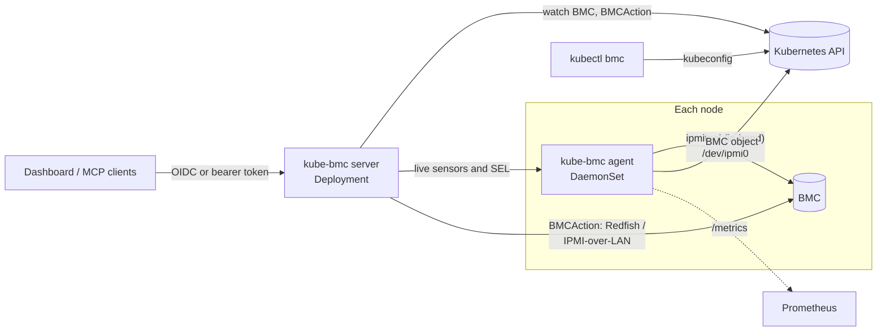

<p align="center">
  
</p>

<h1 align="center">kube-bmc</h1>

<p align="center">
  Baseboard management controllers as Kubernetes resources: in-band discovery, hardware health,<br>
  out-of-band power control, a web dashboard, a kubectl plugin and an MCP endpoint for AI agents.
</p>

<p align="center">
  <a href="https://github.com/aireet/kube-bmc/actions/workflows/ci.yml"></a>
  <a href="https://goreportcard.com/report/github.com/aireet/kube-bmc"></a>
  <a href="https://scorecard.dev/viewer/?uri=github.com/aireet/kube-bmc"></a>
  <a href="LICENSE"></a>
</p>

<p align="center">
  <a href="README.zh-CN.md">简体中文</a> ·
  <a href="#installation">Installation</a> ·
  <a href="#architecture">Architecture</a> ·
  <a href="docs/authentication.md">Authentication</a> ·
  <a href="docs/mcp.md">MCP</a> ·
  <a href="docs/kubectl.md">kubectl plugin</a>
</p>


## Overview

kube-bmc runs an agent on every node that reads the local BMC through the in-band IPMI
interface (`/dev/ipmi0`). No BMC addresses or credentials are needed for monitoring. Each node
gets a cluster-scoped `BMC` object that is owned by its `Node`:

```console
$ kubectl get bmc
NAME        NODE        BMC-IP          VENDOR   MODEL        POWER   WATTS   INLET   HEALTH     AGE
host002     host002     10.30.4.27      LCWT     R8285        On      951     26      Warning    2d
server131   server131   10.20.0.31      Gooxi    SY8108G-G4   On      1240    43      Critical   2d

$ kubectl get bmc server131 -o jsonpath='{range .status.problems[*]}{.severity}{"\t"}{.source}{"\t"}{.message}{"\n"}{end}'
Critical   FAN7      0 RPM below lower non-recoverable
Critical   chassis   Cooling/Fan Fault reported by the BMC
Warning    sel       System Event Log is 100% full; new hardware events may be dropped
```

Features:

- **Inventory and health** from any IPMI 2.0 BMC: FRU data, firmware, management network,
  sensors with thresholds, chassis faults, DCMI power and the System Event Log. Health is
  summarized as `OK`, `Warning` or `Critical` with a list of problems.
- **Power control** (`On`, `GracefulShutdown`, `GracefulRestart`, `ForceRestart`, `PowerCycle`,
  `ForceOff`) over Redfish or IPMI-over-LAN. Every request is a `BMCAction` object, which serves
  as the audit record. Disabled by default.
- **Three interfaces with one permission model**: the web dashboard, the `kubectl bmc` plugin
  and an MCP endpoint for AI agents. All of them are authorized with Kubernetes RBAC.
- **Authentication** with OpenID Connect for the dashboard, and OIDC or Kubernetes bearer tokens
  for API and MCP clients.
- **Prometheus metrics** for every sensor, power draw, health and SEL usage.

## Installation

Requirements:

- Kubernetes 1.30 or later (the chart uses a ValidatingAdmissionPolicy).
- Nodes with a BMC and the IPMI kernel modules loaded (`ipmi_si`, `ipmi_devintf`), so that
  `/dev/ipmi0` exists. Nodes without a BMC can be excluded with `agent.nodeSelector`.

```bash
helm install kube-bmc oci://ghcr.io/aireet/charts/kube-bmc \
  --namespace kube-bmc-system --create-namespace

kubectl get bmc
kubectl -n kube-bmc-system port-forward svc/kube-bmc 8080:80   # dashboard on http://localhost:8080
```

Plain manifests are attached to each release:
`kubectl apply -f https://github.com/aireet/kube-bmc/releases/latest/download/install.yaml`.

The chart installs without authentication. Before exposing the dashboard beyond a port-forward,
configure [authentication](docs/authentication.md).

## Architecture



**Agent.** Runs privileged on every node and polls the local BMC with read-only `ipmitool`
commands on three schedules:

| Data | Default interval | Notes |
|---|---|---|
| Sensors, chassis status, DCMI power, SEL info | 30s | Uses a local SDR cache; one round takes about one second |
| FRU, LAN configuration, firmware, thresholds | 10m | `ipmitool sensor` takes about ten seconds over KCS |
| SEL entries | When `sel info` reports a change, at most every 5m | Reading the full SEL can take more than 30 seconds |

The agent keeps the load on the API server and etcd low:

- Liveness is reported by renewing a small `coordination.k8s.io` Lease per node, as kubelet does
  for nodes, instead of rewriting the `BMC` status.
- The `BMC` status is written only when health, problems, conditions or inventory change, when a
  reading leaves its deadband (power ±10% or 50 W, inlet temperature ±3 °C, SEL usage ±5 points),
  or every 10 minutes. The agent patches against the last written object without reading it first.
- Complete sensor lists and SEL entries are served by the agent on request and never stored in etcd.

In steady state each node causes about one status write per 10 minutes plus one Lease renewal per
minute. `kube_bmc_status_writes_total{reason}` reports the write rate.

**Server.** Serves the dashboard, the JSON API and the MCP endpoint, authenticates users, and
runs the controller that executes `BMCAction` objects. It is stateless and reads through an
informer cache.

**kubectl plugin.** Reads `BMC` and `BMCAction` objects directly and fetches live data from the
agents through the API server's pod proxy, using the caller's kubeconfig.

## Power actions

A power action is a `BMCAction` object:

```yaml
apiVersion: bmc.kube-bmc.io/v1alpha1
kind: BMCAction
metadata:
  generateName: gpu-01-forcerestart-
spec:
  bmcName: gpu-01
  action: ForceRestart
  requestedBy: oidc:alice@example.com
  reason: kernel hang, node unreachable
status:
  phase: Succeeded            # Pending, Running, Succeeded, Failed or Rejected
  message: ForceRestart accepted by the BMC
  powerStateBefore: "On"
```

- The server executes each action once, out-of-band through Redfish or IPMI-over-LAN, so it
  works when the node is down. The outcome is also recorded as an Event on the `Node`.
- A ValidatingAdmissionPolicy requires `spec.requestedBy` to equal the authenticated user. Only
  the kube-bmc server, which authenticates dashboard and MCP users itself, may set another value.
- With `server.powerActions.enabled=false` (the default), actions are recorded and rejected.
- Finished actions are deleted after `server.powerActions.ttl` (seven days by default).

To enable power actions, provide BMC credentials:

```bash
kubectl -n kube-bmc-system create secret generic bmc-credentials \
  --from-literal=username=kube-bmc --from-literal=password='...'

helm upgrade kube-bmc oci://ghcr.io/aireet/charts/kube-bmc -n kube-bmc-system --reuse-values \
  --set server.powerActions.enabled=true \
  --set server.credentials.existingSecret=bmc-credentials
```

The BMC address is discovered in-band. To override it, or to use per-server credentials or IPMI
instead of Redfish, edit the `BMC` spec (see [examples/bmc-override.yaml](examples/bmc-override.yaml)).

## Access control

The dashboard, the MCP endpoint and the kubectl plugin share one permission model based on
Kubernetes RBAC. The chart creates two ClusterRoles:

| Role | Grants |
|---|---|
| `kube-bmc-viewer` | Read BMCs, actions, live sensors and events. Aggregated into the built-in `view` role. |
| `kube-bmc-operator` | `kube-bmc-viewer` plus creating `BMCAction` objects |

```yaml
# values.yaml
rbac:
  viewers:
    - { kind: Group, name: "oidc:engineering", apiGroup: rbac.authorization.k8s.io }
  operators:
    - { kind: Group, name: "oidc:sre", apiGroup: rbac.authorization.k8s.io }
```

For dashboard and MCP users the server performs a SubjectAccessReview with the user's OIDC
username and groups (prefixed with `oidc:` by default). See [docs/authentication.md](docs/authentication.md).

## MCP endpoint

The server exposes the Model Context Protocol over Streamable HTTP at `/mcp`. Tools:
`fleet_summary`, `list_servers`, `get_server`, `get_sensors`, `get_events`, `list_actions`,
`get_action` and `power_action`, plus a `diagnose_server` prompt.

```bash
claude mcp add --transport http kube-bmc https://kube-bmc.example.com/mcp \
  --header "Authorization: Bearer $TOKEN"
```

`$TOKEN` is an OIDC ID token or a Kubernetes ServiceAccount token whose identity is bound to
`kube-bmc-viewer` or `kube-bmc-operator`.

`power_action` is annotated as destructive, requires a reason and is subject to the
`kube-bmc-operator` role. See [docs/mcp.md](docs/mcp.md).

## kubectl plugin

```console
$ kubectl bmc list
$ kubectl bmc describe server131
$ kubectl bmc sensors server131 --problems
$ kubectl bmc events server131 --grep fan
$ kubectl bmc power server131 ForceRestart --reason "kernel hang" --wait
$ kubectl bmc actions
```

Download `kubectl-bmc` from the [releases](https://github.com/aireet/kube-bmc/releases) and place
it on your `PATH`. See [docs/kubectl.md](docs/kubectl.md).

## Metrics

Agents expose Prometheus metrics on port 9580. Every metric carries a `node` label. Set
`metrics.podMonitor.enabled=true` to create a PodMonitor.

| Metric | Description |
|---|---|
| `kube_bmc_up` | 1 if the last collection round reached the BMC |
| `kube_bmc_health` | 0 unknown, 1 ok, 2 warning, 3 critical |
| `kube_bmc_power_on`, `kube_bmc_power_watts` | Chassis power state and DCMI power draw |
| `kube_bmc_sensor_value{sensor,type,unit}` | Sensor readings |
| `kube_bmc_sensor_state{sensor,type}` | 0 ok, 1 warning, 2 critical, -1 no reading |
| `kube_bmc_chassis_fault{fault}` | Active chassis faults |
| `kube_bmc_sel_used_ratio`, `kube_bmc_sel_entries` | System Event Log usage |
| `kube_bmc_info{manufacturer,product,serial,firmware,bmc_ip,bmc_mac}` | Inventory |
| `kube_bmc_collect_duration_seconds{phase}`, `kube_bmc_collect_errors_total{phase}` | Collector performance |

Example alerting rules: [examples/prometheus-rules.yaml](examples/prometheus-rules.yaml).

## Security

- The agent runs privileged because opening `/dev/ipmi0` requires it. It only issues read-only
  commands (`mc info`, `mc guid`, `lan print`, `fru print`, `chassis status`, `sdr`, `sensor`,
  `sel info`, `sel elist`, `dcmi power reading`).
- The server runs as non-root with a read-only root filesystem and no capabilities. It reads
  Secrets only in its own namespace.
- Without authentication (`auth.mode=none`) everyone who can reach the server can read BMC data
  and, if power actions are enabled, request them.
- IPMI-over-LAN has known weaknesses. Keep BMC networks isolated and prefer Redfish.

Report vulnerabilities as described in [SECURITY.md](SECURITY.md).

## Configuration

All chart values are documented in [charts/kube-bmc/values.yaml](charts/kube-bmc/values.yaml).

| Value | Default | Description |
|---|---|---|
| `agent.interval` | `30s` | Sensor polling interval |
| `agent.nodeSelector` | `{}` | Nodes that run the agent |
| `server.externalURL` | `""` | Public URL of the dashboard; required for OIDC |
| `server.powerActions.enabled` | `false` | Execute power actions |
| `server.credentials.existingSecret` | `""` | Default BMC credentials (`username`, `password`) |
| `server.service.type` | `ClusterIP` | Service type of the dashboard |
| `auth.mode` | `none` | `none` or `oidc` |
| `auth.oidc.issuerURL` | `""` | OIDC issuer |
| `rbac.viewers`, `rbac.operators` | `[]` | Subjects bound to the kube-bmc roles |
| `metrics.podMonitor.enabled` | `false` | Create a PodMonitor for the agents |

## Development

```bash
make ui         # build the dashboard into web/dist
make build      # build bin/kube-bmc and bin/kubectl-bmc
make test       # unit tests
make lint       # golangci-lint and vue-tsc
make generate   # deepcopy functions and CRDs after changing api/
make dev        # dashboard with hot reload against a port-forwarded server on :8080
```

| Path | Contents |
|---|---|
| `api/v1alpha1` | `BMC` and `BMCAction` types |
| `cmd/kube-bmc` | Agent and server binary |
| `cmd/kubectl-bmc` | kubectl plugin |
| `internal/ipmi` | ipmitool client and parsers, tested against recorded output of real BMCs |
| `internal/collector` | Polling, health evaluation and metrics |
| `internal/agent` | BMC object lifecycle and agent HTTP API |
| `internal/controller` | `BMCAction` execution |
| `internal/oob` | Redfish and IPMI-over-LAN power control |
| `internal/auth` | OIDC, bearer tokens and RBAC authorization |
| `internal/server` | Dashboard API |
| `internal/mcpserver` | MCP tools and prompts |
| `internal/kubectl` | kubectl plugin commands |
| `ui` | Vue 3 and Naive UI dashboard, embedded into the server binary |
| `charts/kube-bmc` | Helm chart |

See [CONTRIBUTING.md](CONTRIBUTING.md).

## Community

- [Governance](GOVERNANCE.md) and [maintainers](MAINTAINERS.md)
- [Design proposals](docs/proposals)
- [Code of Conduct](CODE_OF_CONDUCT.md) (CNCF Code of Conduct)
- [Security policy](SECURITY.md), including how to verify signed releases
- [Adopters](ADOPTERS.md)

## License

[Apache 2.0](LICENSE)
