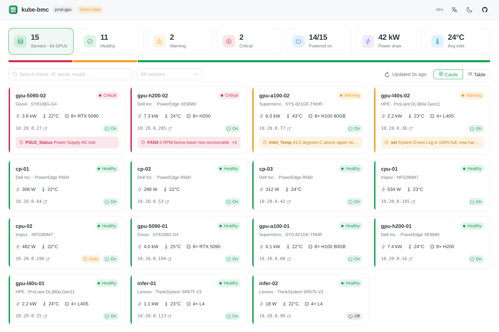

<p align="center">
  
</p>

<h1 align="center">kube-bmc</h1>

<p align="center">
  把服务器 BMC 作为 Kubernetes 资源管理：带内自动发现、硬件健康、带外电源控制，<br>
  并提供 Web 控制台、kubectl 插件和面向 AI Agent 的 MCP 接口。
</p>

<p align="center">
  <a href="https://github.com/aireet/kube-bmc/actions/workflows/ci.yml"></a>
  <a href="LICENSE"></a>
</p>

<p align="center"><a href="README.md">English</a></p>



## 概述

kube-bmc 在每个节点上运行一个 agent，通过带内 IPMI 接口（`/dev/ipmi0`）读取本机 BMC。监控不需要 BMC 地址，也不需要凭证。每个节点对应一个集群级 `BMC` 对象，其 owner 是对应的 `Node`。

```console
$ kubectl get bmc
NAME        NODE        BMC-IP          VENDOR   MODEL        POWER   WATTS   INLET   HEALTH     AGE
host002     host002     10.30.4.27      LCWT     R8285        On      951     26      Warning    2d
server131   server131   10.20.0.31      Gooxi    SY8108G-G4   On      1240    43      Critical   2d
```

功能：

- **资产与健康**：支持任意 IPMI 2.0 BMC，采集 FRU、固件、管理网络、带阈值的传感器、机箱故障、DCMI 功耗和系统事件日志（SEL），汇总为 `OK` / `Warning` / `Critical` 健康状态，并给出问题列表。
- **电源控制**（`On`、`GracefulShutdown`、`GracefulRestart`、`ForceRestart`、`PowerCycle`、`ForceOff`）：通过 Redfish 或 IPMI-over-LAN 执行。每次请求都是一个 `BMCAction` 对象，同时作为审计记录。默认关闭。
- **三种入口**：Web 控制台、`kubectl bmc` 插件和 MCP 接口。所有电源操作都会记录发起人身份。
- **认证**：控制台使用 OpenID Connect 登录；API 和 MCP 客户端可使用 OIDC token，或 kube-bmc 所在 namespace 中 ServiceAccount 的 token。
- **Prometheus 指标**：覆盖每个传感器，以及功耗、健康状态和 SEL 使用率。

## 安装

要求 Kubernetes 1.28 及以上版本；节点需有 BMC，并已加载 `ipmi_si`、`ipmi_devintf` 内核模块（即存在 `/dev/ipmi0`）。

```bash
helm install kube-bmc oci://ghcr.io/aireet/charts/kube-bmc \
  --namespace kube-bmc-system --create-namespace

kubectl get bmc
kubectl -n kube-bmc-system port-forward svc/kube-bmc 8080:80
```

默认安装不启用认证。如果要在 port-forward 之外暴露控制台，请先配置[认证](docs/authentication.md)。

## 架构

- **Agent**（DaemonSet，privileged）：只执行只读的 `ipmitool` 命令。传感器、机箱状态和功耗每 30 秒采集一次（借助本地 SDR 缓存，每轮约 1 秒）；FRU、网络、固件和阈值每 10 分钟采集一次；SEL 只在 `sel info` 显示有变化时才读取，且间隔至少 5 分钟。健康、电源或资产信息变化时立即写入 `BMC` status；只有读数变化时，最多每 2 分钟写一次。完整的传感器列表和 SEL 条目由 agent 按需提供，不写入 etcd。
- **Server**（Deployment）：提供控制台、JSON API 和 MCP 接口，负责用户认证，并运行执行 `BMCAction` 的 controller。本身无状态，通过 informer 缓存读取数据。
- **kubectl 插件**：使用调用者的 kubeconfig，直接读写 `BMC` 和 `BMCAction`，并通过 API Server 的 pod proxy 从 agent 获取实时数据。

## 电源操作与认证

- 电源操作以 `BMCAction` 对象的形式提交，由 server 通过带外通道执行一次，节点宕机时同样可用。执行结果会记录为 Node Event。
- `spec.requestedBy` 由 server（控制台和 MCP）和 kubectl-bmc 设置为已认证的用户。
- `server.powerActions.enabled=false`（默认）时，所有操作都会被记录并拒绝。
- kube-bmc 面向管理集群的运维团队：只做认证并记录发起人，所有已登录用户都拥有全部权限。能否登录在 IdP 侧控制。

## MCP 与 kubectl

```bash
claude mcp add --transport http kube-bmc https://kube-bmc.example.com/mcp \
  --header "Authorization: Bearer $TOKEN"

kubectl bmc list
kubectl bmc sensors server131 --problems
kubectl bmc power server131 ForceRestart --reason "kernel hang" --wait
```

MCP 工具包括 `fleet_summary`、`list_servers`、`get_server`、`get_sensors`、`get_events`、`list_actions`、`get_action` 和 `power_action`，另有提示词 `diagnose_server`。其中 `power_action` 标注为破坏性操作，必须填写原因。

详细文档：

- [认证与授权](docs/authentication.md)
- [MCP 接口](docs/mcp.md)
- [kubectl 插件](docs/kubectl.md)
- [英文 README](README.md)：指标、配置与开发

## 许可证

[Apache 2.0](LICENSE)
