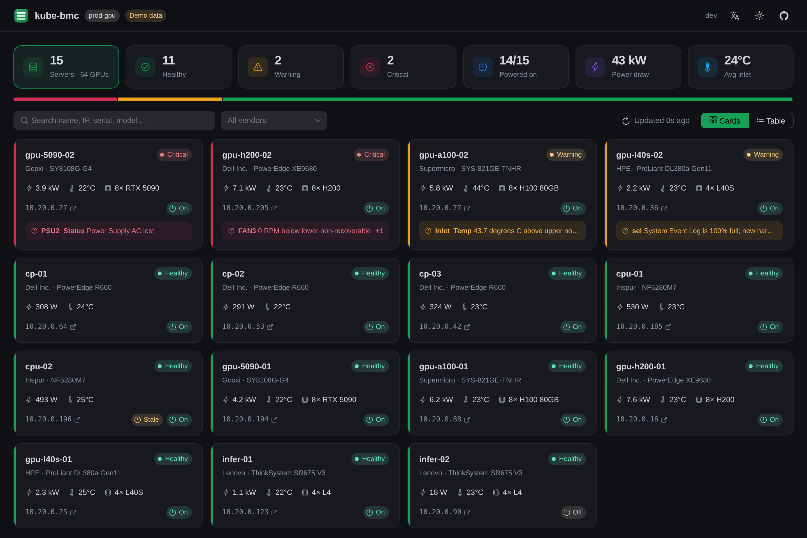

<p align="center">
  
</p>

<h1 align="center">kube-bmc</h1>

<p align="center">
  <b>把服务器的 BMC 变成 Kubernetes 资源。</b><br>
  裸金属集群的零配置硬件发现、健康监控与电源控制：不用收集 BMC 密码，也不用维护 Excel。
</p>

<p align="center">
  <a href="https://github.com/aireet/kube-bmc/actions/workflows/ci.yml"></a>
  <a href="LICENSE"></a>
</p>

<p align="center"><a href="README.md">English</a></p>



```console
$ kubectl get bmc
NAME          NODE          BMC-IP        VENDOR      MODEL               POWER   WATTS   INLET   HEALTH     AGE
gpu-h200-02   gpu-h200-02   10.20.0.205   Dell Inc.   PowerEdge XE9680    On      7233    24      Critical   41d
gpu-5090-01   gpu-5090-01   10.20.0.194   Gooxi       SY8108G-G4          On      4153    22      OK         12d
```

## 为什么做这个

每个裸金属 K8s 集群背后都有一套"看不见的控制面"：每台服务器里的 **BMC**（iDRAC、iLO、XClarity、Supermicro、AMI MegaRAC……）。节点 `NotReady` 时，答案往往就在那里：风扇停转、电源掉了、SEL 日志写满。可是要看到这些，得先翻表格找 BMC IP、找密码，再点进各家风格各异的 Web 界面。

kube-bmc 把这件事做成了 K8s 原生：

- **零配置**：DaemonSet 通过 `/dev/ipmi0` **带内**读取本机 BMC，不用收集 IP，也不用管理凭证，每个节点自动注册。
- **K8s 原生**：每个节点对应一个集群级 `BMC` 对象，Owner 是 `Node`，节点删除时随之回收。一条 `kubectl get bmc` 就能看全集群硬件。
- **直接给出问题，而不只是一堆数字**：越过阈值的传感器、机箱故障、电源 AC 掉电、SEL 写满，都会汇总成可读的 `status.problems` 列表和 `OK / Warning / Critical` 健康状态。
- **好看好用的控制台**：集群总览、带阈值条的传感器、SEL 事件查看器，支持深浅色和中英文。
- **带外电源控制**：走 Redfish 或 IPMI-over-LAN，节点宕机时也能用。默认关闭，需要二次确认，操作会作为 K8s Event 留下审计记录。
- **Prometheus 指标**：覆盖每个传感器，以及功耗、健康状态、SEL 使用率。
- **厂商无关**：只要支持 IPMI 2.0 就行，近 15 年的服务器 BMC 基本都支持。

## 快速开始

**本地体验控制台**（内置 15 台服务器的演示数据，不需要集群）：

```bash
docker run --rm -p 8080:8080 ghcr.io/aireet/kube-bmc:edge server --demo
```

**安装到集群：**

```bash
helm install kube-bmc oci://ghcr.io/aireet/charts/kube-bmc \
  --namespace kube-bmc-system --create-namespace

kubectl get bmc
kubectl -n kube-bmc-system port-forward svc/kube-bmc 8080:80
```

前提：节点有 BMC，并已加载 IPMI 内核模块（`ipmi_si`、`ipmi_devintf`），即存在 `/dev/ipmi0`。

## 工作原理

- **Agent**（每节点一个，privileged）用 `ipmitool` 分三档频率采集。这些频率都是在真实硬件上调出来的：
  - 传感器、机箱状态、DCMI 功耗、SEL 概要：每 30 秒一次。借助本地 SDR 缓存，每轮约 1 秒，比直接读 SDR 快 6 倍。
  - FRU、网络、固件、阈值：每 10 分钟一次（单是 `ipmitool sensor` 走 KCS 就要约 10 秒）。
  - SEL 明细：只在 `sel info` 显示有新事件时才读（至少间隔 5 分钟），因为整条 SEL 走 KCS 可能要 30 秒以上。
- 状态写入有节流：健康、电源或资产信息变化时立即写，否则最多每 2 分钟写一次，千节点规模也不会压垮 API Server。完整传感器列表和 SEL 由 agent 实时提供，不存进 etcd。
- **Server**（一个小 Deployment）通过 informer 缓存 watch `BMC`、`Node` 和 agent Pod，提供内嵌的 Vue 3 + Naive UI 控制台和 JSON API，并负责执行带外电源操作。

所有组件打包在**一个约 70MB 的镜像**里（`kube-bmc agent` / `kube-bmc server`）。

## 安全

- **Agent 是 privileged**，因为打开 `/dev/ipmi0` 需要这个权限。它只执行只读的 ipmitool 命令，从不修改 BMC 配置、用户或电源。
- **Server 无特权运行**（non-root、只读根文件系统、去掉所有 capabilities），只能读取**自己 namespace** 里的 Secret。
- **电源操作默认关闭**，开启后需要输入服务器名二次确认，并记录 Event。控制台本身不带登录认证，开启电源操作前请在前面加 [oauth2-proxy](https://oauth2-proxy.github.io/oauth2-proxy/) 之类的认证代理。

更多内容（CRD 字段、指标列表、告警示例、Helm 参数、开发指南）见 [English README](README.md)。

## 许可证

[Apache 2.0](LICENSE)
