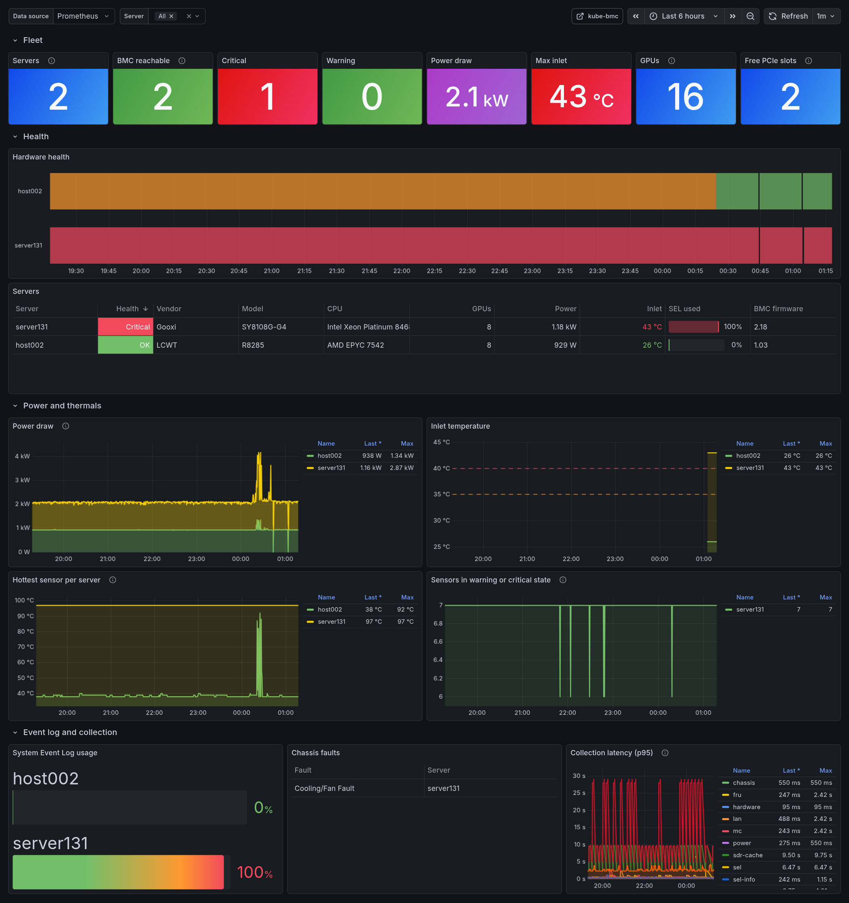

# Grafana dashboard

The `kube-bmc` dashboard shows the hardware of the fleet from the agents' Prometheus metrics:

- **Fleet**: servers, reachable BMCs, servers in critical or warning state, total power draw,
  maximum inlet temperature, GPUs and free PCIe slots.
- **Health**: health over time per server and a table with vendor, model, CPU, GPUs, power,
  inlet temperature, SEL usage and BMC firmware.
- **Power and thermals**: power draw, inlet temperature, the hottest sensor per server and the
  number of sensors outside their thresholds.
- **Event log and collection**: SEL usage, active chassis faults and collection latency.



## Metrics

Agents expose metrics on port 9580 and carry the `prometheus.io/scrape` annotations, so a
Prometheus that scrapes annotated pods (the default `kubernetes-pods` job of the Prometheus
community chart) collects them without configuration. With the Prometheus Operator, set
`metrics.podMonitor.enabled=true`. Every series has a `node` label.

## Installation

**Grafana sidecar** (kube-prometheus-stack, or the grafana chart with
`sidecar.dashboards.enabled`): let the chart create the dashboard ConfigMap.

```yaml
grafana:
  dashboard:
    enabled: true
    namespace: monitoring   # where the sidecar looks for dashboards, if restricted
```

**Manual import**: in Grafana, open *Dashboards → New → Import* and upload
[`charts/kube-bmc/dashboards/kube-bmc.json`](../charts/kube-bmc/dashboards/kube-bmc.json), or use
the API:

```bash
curl -u admin:$GRAFANA_PASSWORD -H 'Content-Type: application/json' \
  -d "{\"dashboard\": $(cat charts/kube-bmc/dashboards/kube-bmc.json), \"overwrite\": true}" \
  https://grafana.example.com/api/dashboards/db
```

Select the Prometheus data source in the `Data source` variable at the top of the dashboard.
